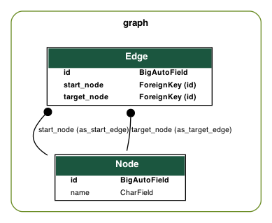
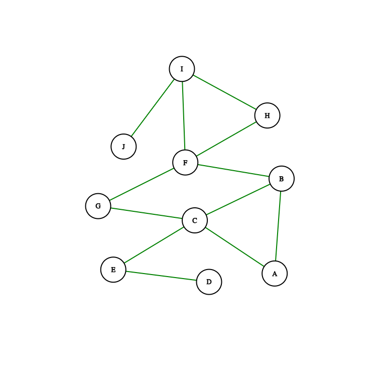

[](https://python.org)
[](https://djangoproject.com)
[](https://www.django-rest-framework.org/)

# HuspyIoTask

Please create the following REST endpoints in Django:

```json

Endpoint: /connectNode
Method: POST

payload = {
  "From": "<from_node in string format>",
  "To": "<to_node in string format>"
}
```

> This endpoint connects two nodes in a graph. We should persist these connections to a db.

```json
Endpoint: /path
Method: GET

query_params: ?from=<from_node in string format>&to=<to_node in string format>

This endpoint will get the shortest path from from_node to to_node

Response

{
 "Path": "A, B, C"
}
```

## Example

```json
Endpoint: /connectNode
Method: POST

payload = {
 "From": "A",
 "To": "B"
}
```

> Now a node called A is created and is connected to node B. So now it looks like this A <-> B

```json
Endpoint: /connectNode
Method: POST

payload = {
 "From" :"B",
 "To": "C"
}
```

> Now B is connected to node C. So now it looks like this: A <-> B <-> C

```json
Endpoint: /path
Method: GET

query_params: ?from=A&to=C

Response
{
 "Path": "A, B, C"
}
```

# Implementation

The backend is implemented using Django in Pyhton, with Django REST framework.

## Model Relationship Daigram



## Running locally 

1. Clone github repository

```bash
git clone https://github.com/santoshpy/HuspyIoTask.git
```
2. got to folder HuspyIoTask
```bash
cd HuspyIoTask/
```

3. Rename example.env file to .env
```bash
mv example.env .env
```
4. Change appropriate enviroement varaiable in .env file
5. Build and run via docker compose
```bash
docker compose up --build
```

## TestCase Graph



